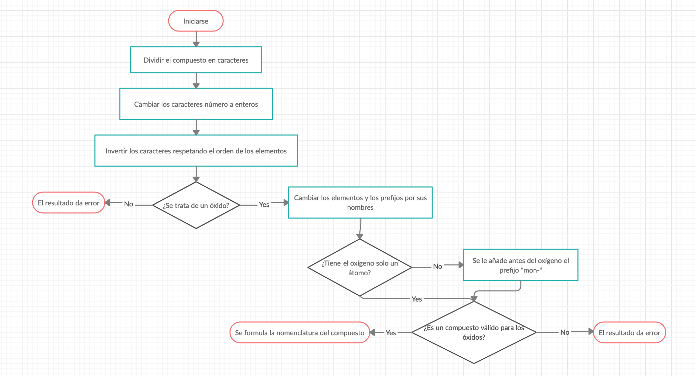

# Química IA Versión 1

## PROBLEMA A SOLUCIONAR
El problema que se ha decidido solucionar es el de la **formulación de compuestos químicos**, únicamente óxidos, mediante el uso del lenguaje de programación prolog.

El funcionamiento del programa es simple y es el siguiente: Al iniciar prolog es necesario iniciarlo con la base de conocimientos **formulacion.pl** y una vez iniciado se pregunta el compuesto del que deseamos conocer la formulación mediante la regla **compuesto_quimico(Elemento, X).**.

## REGLAS
La regla **invertir_elemento** es la encargada de dar la vuelta a los elementos, reordenandolos de forma que los caracteres de los elementos no sean alterados.

La regla **string_elemento** es la encargada de convertir los caracteres numéricos en enteros.

La regla **es_oxido** se encarga de comprobar que el compuesto que hemos introducido es un óxido, para ello busca si está presente el oxígeno en la fórmula introducida. Como los óxidos unicamente están formados por oxígeno y otro elemento (metal o no metal) distinto del oxigeno la regla buscará si hay como mínimo un átomo de oxígeno en la dos primeras posiciones de la lista (ya que con hemos invertido el compuesto) dependiendo si hay más de un átomo.

La regla **elemento_nombre** es la encargada de asignar a cada elemento de la formula introducida su correspondiente nombre de la tabla periódica, para ello se hace uso de una base de conocimiento adicional **elementos.pl** en la cual se reflejan los principales elementos químicos junto con su abreviación.

La regla **formular** es la encargada de unir todos los prefijos y elementos del compuesto en correcto orden obteniendo un único string.

Por último, la regla **compuesto_quimico** hace uso de todas las reglas anteriores para dar salida a la formulación exacta del compuesto químico.

## FACTS
Aqui se añade las posibilidades de tipos de prefijos que existen, siendo estos: "mon", "di", "tri" y "tetra" siendo uno, dos, tres y cuatro respectivamente.

## DIAGRAMA DE FLUJO
