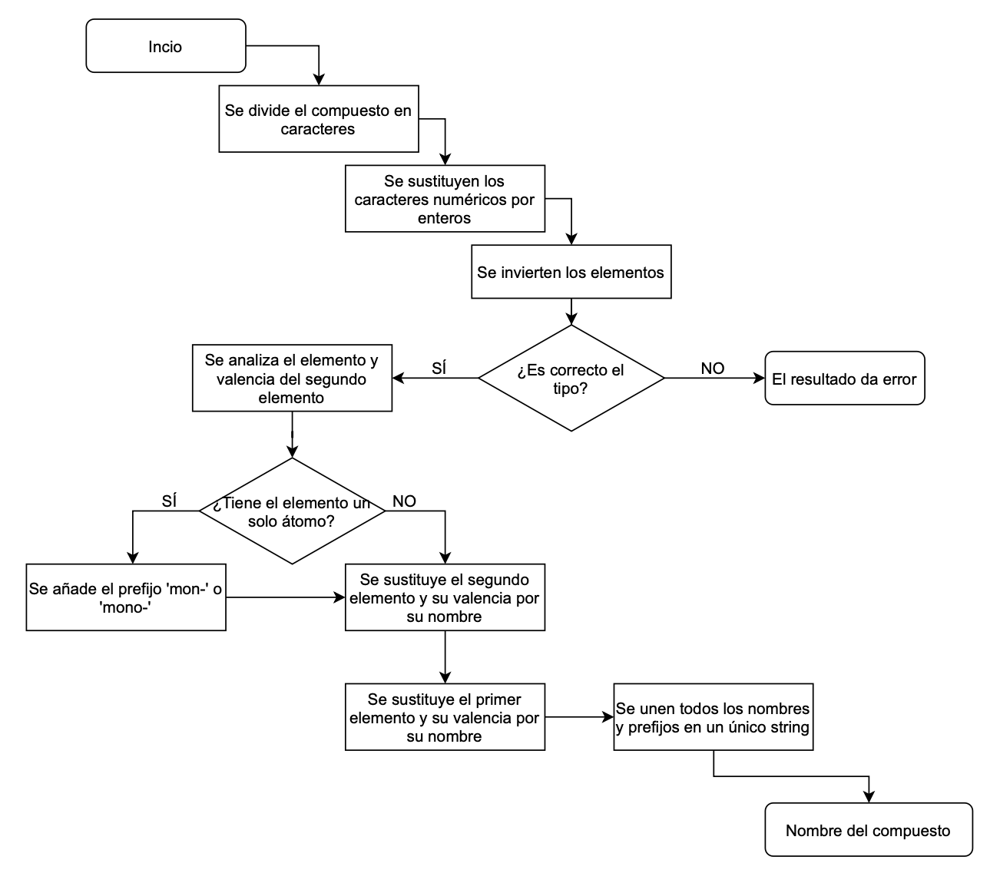

# Química IA Versión 2

## PROBLEMA A SOLUCIONAR
El problema propuesto para su resolución es la **formulación de compuestos químicos** mediante el uso del lenguaje de programación **Prolog**.

## FUNCIONAMIENTO
Para correr el programa debemos:

1. Mediante un terminal, ejecutar en Prolog la base de conocimientos **formulacion.pl**.

```
swipl formulacion.pl
```

2. Una vez se haya iniciado el entorno de Prolog, se usará la regla **compuesto_quimico(Elemento, X).** para realizar una consulta de un compuesto,
    - Ejemplo: para consultar el nombre del compuesto **CO2**, la regla será: 

```
compuesto_quimico(co2, X).
```

## REGLAS
La regla **string_elemento** se encarga de convertir los caracteres numéricos en enteros.

La regla **invertir_elemento** se encarga de invertir el orden de los elementos sin alterar el orden de los elementos, reordenandolos de forma ques sus caracteres no sean alterados.

La regla **tipo_correcto** se encarga de comprobar que el compuesto que hemos introducido es un compuesto binario. Para ello:
1. Comprueba el último elemento del compuesto.
    - Si es elemento es **Oxígeno** o **Hidrógeno**, pasa la regla
    - Si es elemento es un **no metal**, pasa la regla si el otro elemento es un **metal**.

La regla **nombre_prefijo** se encarga de asignar al segundo elemento del compuesto su corresponiente nombre de la tabla periodica y su valencia. Para ello se hace uso de una base de conocimiento adicional **elementos.pl** en la cual se reflejan los principales elementos químicos junto con su abreviación.

La regla **nombre_elmento** se encarga de asignar al primer del compuesto elemento su correspondiente nombre de la tabla periódica y su valencia. Para ello se vuelve ha hacer uso de una base de conocimiento adicional **elementos.pl**.

La regla **formular** se encarga de unir todos los elementos del compuesto en correcto orden dando como resultado un único string.

Por último, la regla **compuesto_quimico** hace uso de todas las reglas anteriores para dar salida a la formulación exacta del compuesto químico.

## FACTS
Se añaden los algunos tipos de prefijos que existen. Estos son: "di", "tri" y "tetra" siendo dos, tres y cuatro respectivamente.

## DIAGRAMA DE FLUJO

